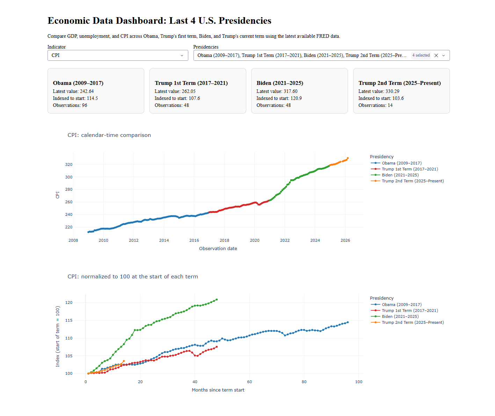
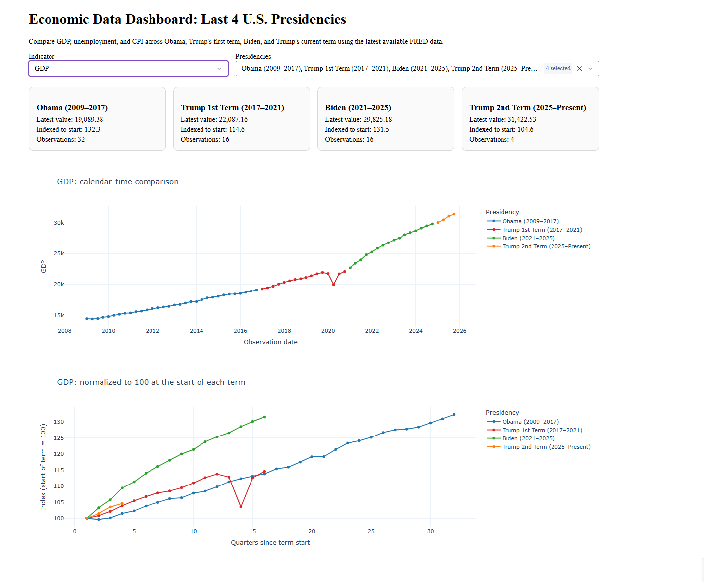
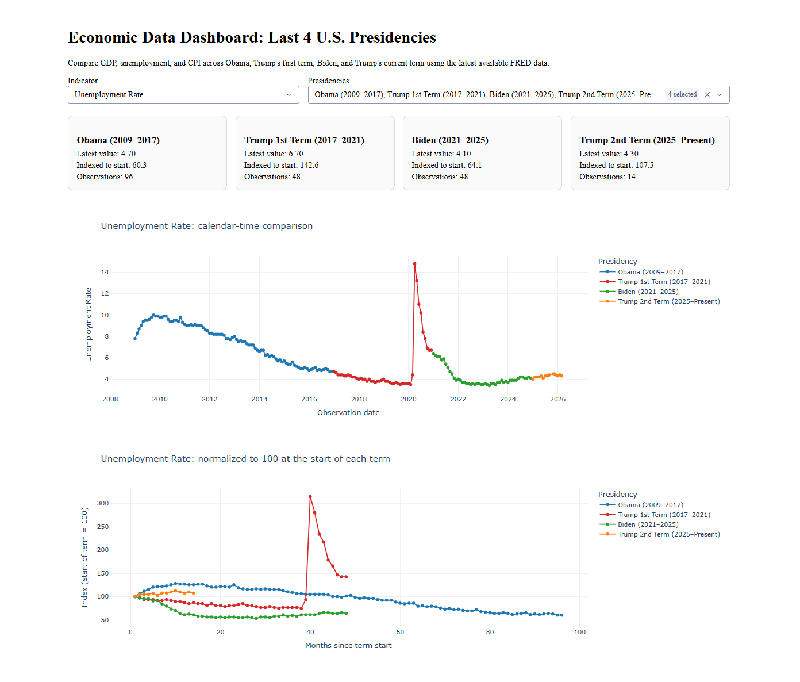

# Economic Data Analysis Dashboard: The Last 4 U.S. Presidencies

## Overview

This project compares key U.S. economic indicators—**GDP**, **Unemployment Rate**, and **CPI (Inflation)**—across the last **four presidential terms**:

- **Obama (2009–2017)**
- **Trump 1st Term (2017–2021)**
- **Biden (2021–2025)**
- **Trump 2nd Term (2025–Present)**

The project downloads the latest available data from the [Federal Reserve Economic Data (FRED)](https://fred.stlouisfed.org/) service, cleans and normalizes it, optionally loads it into PostgreSQL, and visualizes it in an interactive Dash dashboard.

This version improves the original project by:

- expanding the comparison from **2** presidencies to **4**
- bundling a **processed CSV dataset** so the dashboard can run without a database
- refreshing the ingestion pipeline to pull **latest available** public FRED data
- adding a **normalized comparison view** to compare term trajectories more fairly

## Project Structure

```
/economic-dashboard
│
├── project_config.py                  # Shared config for indicators, presidencies, and file paths
├── data_ingestion/
│   ├── fetch_data.py                  # Downloads latest FRED data and slices it by presidency
│   ├── load_data_db.py                # Loads the cleaned CSV into PostgreSQL
│   └── *.json                         # Raw term-level JSON files generated from FRED series
│
├── database/
│   ├── create_tables.sql              # SQL schema for the expanded dataset
│   └── queries.sql                    # Example analysis queries
│
├── data_processing/
│   ├── clean_data.py                  # Builds the cleaned combined dataset
│   └── economic_data.csv              # Processed dataset used by the dashboard
│
├── dashboard/
│   └── app.py                         # Interactive Dash dashboard
│
├── notebooks/
│   └── analysis_notebook.ipynb        # Jupyter notebook for further analysis
│
└── README.md                          # Documentation for the project
```

## Data Sources

- **Gross Domestic Product (`GDP`)**
- **Unemployment Rate (`UNRATE`)**
- **Consumer Price Index for All Urban Consumers (`CPIAUCSL`)**

By default, the ingestion script uses FRED's public CSV endpoint, so an API key is **not required** for the standard workflow.

### Presidency assignment rule

Monthly and quarterly economic indicators do not align perfectly with inauguration dates. To avoid double-counting and to better represent each administration, this project assigns each observation to a presidency using the **end of the observation period**:

- monthly series → last day of the month
- quarterly series → last day of the quarter

For example, **Q1 2021 GDP** is assigned to the Biden term because the quarter ends after January 20, 2021.

## Features

- **Latest data refresh**: Pulls the most recent FRED observations available at run time.
- **Four-presidency comparison**: Extends the analysis across the last four presidential terms.
- **Raw + processed datasets**: Saves term-level JSON files and a cleaned combined CSV.
- **Optional PostgreSQL loading**: Supports structured querying through PostgreSQL.
- **Interactive dashboard**: Lets you switch indicators, select presidencies, and compare both calendar-time values and normalized start-of-term indices.
- **Notebook-ready data**: The processed CSV is easy to consume in pandas or Jupyter.

## Setup Instructions

### 1. Clone the repository
```bash
git clone https://github.com/junelus/economic-dashboard.git
cd economic-dashboard
```

### 2. Install dependencies
```bash
pip install -r requirements.txt
```

### 3. Refresh the data

Download the latest available FRED observations and rebuild the processed dataset:

```bash
python data_ingestion/fetch_data.py
python data_processing/clean_data.py
```

This will:

- regenerate the raw JSON files in `data_ingestion/`
- create/update `data_processing/economic_data.csv`

### 4. Run the dashboard

```bash
python dashboard/app.py
```

Then open:

```text
http://127.0.0.1:8050/
```

The dashboard reads from the processed CSV by default, so PostgreSQL is **optional**.

### 5. Optional: load the data into PostgreSQL

- Make sure you have **PostgreSQL** installed on your system.
- Create a database for the project.
- Set the following environment variables:

```bash
POSTGRES_USER=your_user
POSTGRES_PASSWORD=your_password
POSTGRES_HOST=localhost
POSTGRES_DB=economic_dashboard
```

- Run the loader:
  
```bash
python data_ingestion/load_data_db.py
```

### 6. Optional: create the table manually from SQL

```bash
psql -d economic_dashboard -f database/create_tables.sql
```

### 7. Explore the data in Jupyter

Open the analysis notebook (`analysis_notebook.ipynb`) to perform deeper analysis:

```bash
jupyter notebook notebooks/analysis_notebook.ipynb
```

## Dashboard Views

The dashboard includes:

- **Calendar-time comparison**: See how values moved over actual dates.
- **Normalized term comparison**: Re-index each presidency to **100 at the start of the term**.
- **Presidency filters**: Focus on any subset of the last four terms.
- **Indicator switcher**: Toggle among GDP, unemployment, and CPI.

These views make it easier to compare both the raw magnitude of the economy and the trajectory within each term.

## Conclusion

With the project expanded to the last four presidencies, the dashboard provides a broader historical frame for interpreting economic performance:

- **GDP** shows both the long-run scale of the economy and how sharply different terms accelerated or contracted relative to their own starting points.
- **Unemployment** highlights recession shocks, post-crisis recovery, and the speed of labor-market normalization across administrations.
- **CPI** shows the contrast between relatively subdued inflation periods and the higher-inflation environment of the early 2020s.

Because the current term is still in progress, comparisons involving **Trump's second term** should be interpreted as **partial-term** results based on the latest available data.

-
-
-

Further economic analysis might involve forecasting future trends using statistical models such as **ARIMA** or **linear regression**.

## Contact

For any questions, feel free to reach out via [JimmyUnelus@gmail.com](mailto:JimmyUnelus@gmail.com).
